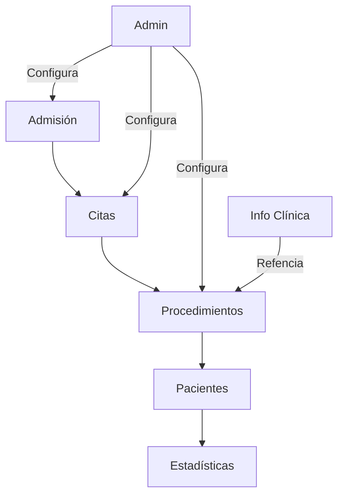

# 🏥 Módulos Funcionales - InteliGastro

## 🎯 Introducción

InteliGastro es un sistema integral de gestión clínica gastroenterológica dividido en 7 módulos principales, cada uno diseñado para manejar aspectos específicos de la operación clínica.

---

## 📋 **Resumen de Módulos**

| Módulo | Páginas | Propósito | Estado |
|--------|---------|-----------|--------|
| [🏠 Principal](#-módulo-principal) | 1 | Dashboard y navegación | ✅ Completo |
| [🏥 Admisión](#-módulo-de-admisión) | 2 | Ingreso de pacientes y procedimientos | 🔄 En desarrollo |
| [📅 Citas](#-módulo-de-citas) | 3 | Gestión de agenda médica | 🔄 En desarrollo |
| [🏥 Procedimientos](#-módulo-de-procedimientos) | 5 | Workflow de procedimientos médicos | 🔄 En desarrollo |
| [👥 Pacientes](#-módulo-de-pacientes) | 1 | Base de datos de pacientes | 🔄 En desarrollo |
| [ℹ️ Info. Clínica](#ℹ️-módulo-de-información-clínica) | 3 | Catálogos y referencias médicas | 🔄 En desarrollo |
| [📊 Estadísticas](#-módulo-de-estadísticas) | 5 | Reportes y análisis | 🔄 En desarrollo |
| [⚙️ Administración](#️-módulo-de-administración) | 14 | Configuración del sistema | 🔄 En desarrollo |

**Total: 34 páginas funcionales**

---

## 🏠 **Módulo Principal**

### Propósito
Portal de entrada y navegación principal del sistema con acceso rápido a todas las funcionalidades.

### Páginas
- **Home** (`/`) - Dashboard principal con bienvenida y navegación

### Características Clave
- 🎨 Interfaz moderna con branding "INTELLISUITE"
- 📅 Fecha actual en español
- 🚀 Acceso rápido a módulos principales
- 📱 Diseño responsivo

### Funcionalidades
- Dashboard con resumen de actividades
- Navegación rápida por tarjetas
- Información contextual del sistema
- Enlaces directos a funciones frecuentes

---

## 🏥 **Módulo de Admisión**

### Propósito
Gestión del proceso de admisión para citas médicas y procedimientos gastroenterológicos.

### Páginas
1. **Cita Médica** (`/admision/cita`) - Registro de nuevas citas
2. **Procedimiento Admisión** (`/admision/procedimiento`) - Admisión de procedimientos

### Características Clave
- 📝 Wizard multi-paso para procesos complejos
- 🔍 Búsqueda inteligente de pacientes existentes
- 📅 Integración con calendario de disponibilidad
- 👨‍⚕️ Selección de médicos y especialidades

### Workflow Típico
1. **Búsqueda/Registro** de paciente
2. **Selección** de tipo de servicio
3. **Programación** de fecha y hora
4. **Asignación** de recursos (médico, sala)
5. **Confirmación** y documentación

### Tecnologías UI
- Material-UI Stepper para procesos
- Formularios con validación
- Búsqueda con autocompletado
- Calendarios interactivos

---

## 📅 **Módulo de Citas**

### Propósito
Gestión completa del flujo de citas médicas desde la programación hasta la finalización.

### Páginas
1. **Agendadas** (`/citas/agendas`) - Citas programadas
2. **En Espera** (`/citas/espera`) - Sala de espera virtual
3. **Finalizadas** (`/citas/finalizadas`) - Historial de citas

### Estados de Cita
- 🔵 **Programada** - Cita agendada
- 🟡 **En Espera** - Paciente esperando
- 🟢 **En Consulta** - Atención en progreso
- ✅ **Finalizada** - Cita completada
- ❌ **Cancelada** - Cita cancelada
- ⚪ **No Show** - Paciente no asistió

### Funcionalidades Clave
- **Gestión de estados** en tiempo real
- **Filtros avanzados** por fecha, médico, especialidad
- **Notificaciones** automáticas
- **Reprogramación** fácil
- **Tiempo de espera** visible
- **Historial completo** de citas

### Integracones
- Sistema de notificaciones
- Calendario del médico
- Historial del paciente
- Sistema de facturación

---

## 🏥 **Módulo de Procedimientos**

### Propósito
Gestión completa del workflow de procedimientos gastroenterológicos desde la orden hasta el alta.

### Páginas
1. **Agenda Hoy** (`/procedimientos/agenda-hoy`) - Vista diaria
2. **Órdenes** (`/procedimientos/ordenes`) - Gestión de órdenes médicas
3. **Agendados** (`/procedimientos/agendados`) - Procedimientos programados
4. **Completados** (`/procedimientos/completados`) - Procedimientos finalizados
5. **Altas** (`/procedimientos/altas`) - Proceso de alta médica

### Tipos de Procedimientos
- 🔬 **Endoscopías** (digestiva alta, colonoscopía)
- 🏥 **Procedimientos terapéuticos**
- 📋 **Estudios diagnósticos**
- 💊 **Tratamientos especializados**

### Workflow de Procedimiento
1. **Orden médica** → Médico solicita procedimiento
2. **Programación** → Asignación de fecha/recursos
3. **Preparación** → Instrucciones al paciente
4. **Ejecución** → Realización del procedimiento
5. **Documentación** → Registro de resultados
6. **Alta** → Instrucciones post-procedimiento

### Características Especiales
- **Gestión de recursos** (salas, equipos)
- **Protocolos de preparación** automatizados
- **Documentación médica** integrada
- **Seguimiento post-procedimiento**
- **Integración con laboratorio**

---

## 👥 **Módulo de Pacientes**

### Propósito
Base de datos centralizada y gestión integral de información de pacientes.

### Páginas
1. **Pacientes** (`/pacientes/pacientes`) - CRUD completo de pacientes

### Información Gestionada
- 📋 **Datos demográficos** básicos
- 📞 **Información de contacto**
- 🏥 **Historial médico**
- 💳 **Información de seguros**
- 👨‍👩‍👧‍👦 **Contactos de emergencia**
- 📄 **Documentos adjuntos**

### Funcionalidades Avanzadas
- **Búsqueda inteligente** por múltiples criterios
- **Historial médico** completo
- **Gestión de documentos** (PDF, imágenes)
- **Alertas médicas** (alergias, condiciones)
- **Seguimiento de visitas**
- **Exportación de datos**

### Validaciones y Seguridad
- Validación de datos personales
- Encriptación de información sensible
- Auditoría de accesos
- Backup automático

---

## ℹ️ **Módulo de Información Clínica**

### Propósito
Catálogos de referencia médica y gestión de recursos clínicos.

### Páginas
1. **Exámenes** (`/info-clinica/examenes`) - Catálogo de estudios
2. **Suministros** (`/info-clinica/suministros`) - Inventario médico
3. **CIE-10** (`/info-clinica/cie10`) - Códigos de diagnóstico

### Gestión de Exámenes
- **Catálogo completo** de estudios disponibles
- **Preparaciones requeridas** por estudio
- **Tiempos de proceso** y entrega
- **Valores de referencia**
- **Precios y coberturas**

### Control de Inventario
- **Stock en tiempo real**
- **Alertas de stock mínimo**
- **Gestión de proveedores**
- **Historial de movimientos**
- **Costos y valorización**

### Códigos CIE-10
- **Base de datos** de diagnósticos
- **Búsqueda inteligente**
- **Códigos frecuentes**
- **Historial de uso**
- **Estadísticas de diagnósticos**

---

## 📊 **Módulo de Estadísticas**

### Propósito
Business Intelligence y reportes analíticos para toma de decisiones.

### Páginas
1. **Dashboard** (`/estadisticas/dashboard`) - KPIs principales
2. **Detallado** (`/estadisticas/detallado`) - Reportes personalizados
3. **Pacientes** (`/estadisticas/pacientes`) - Análisis demográfico
4. **Personal** (`/estadisticas/personal`) - Métricas de personal
5. **Procedimientos** (`/estadisticas/procedimientos`) - Análisis operacional

### KPIs Principales
- 📈 **Volumen de atención** diaria/mensual
- 💰 **Ingresos y facturación**
- ⏱️ **Tiempos de espera** promedio
- 👨‍⚕️ **Productividad** del personal
- 📊 **Ocupación** de recursos
- 😊 **Satisfacción** del paciente

### Tipos de Reportes
- **Operacionales** - Métricas diarias
- **Financieros** - Ingresos y costos
- **Clínicos** - Indicadores médicos
- **Administrativos** - Gestión de recursos

### Funcionalidades Analíticas
- **Filtros avanzados** por período, servicio, médico
- **Comparativas** históricas
- **Exportación** a Excel/PDF
- **Gráficos interactivos**
- **Alertas automáticas**

---

## ⚙️ **Módulo de Administración**

### Propósito
Configuración y administración completa del sistema clínico.

### Páginas (14 total)

#### 🏢 **Gestión Organizacional**
- **Centros** - Sucursales y centros médicos
- **Personal** - Empleados y médicos
- **Horarios** - Horarios de atención

#### 🏥 **Recursos Clínicos**
- **Estudios** - Catálogo de estudios
- **Salas** - Consultorios y salas
- **Recursos** - Equipos y tecnología
- **Exámenes** - Configuración de laboratorio

#### 📋 **Procesos y Protocolos**
- **Preparación** - Instrucciones de preparación
- **Seguros** - Gestión de seguros médicos
- **Plantillas** - Documentos médicos
- **Macros** - Textos predefinidos

#### 👥 **Gestión de Sistema**
- **Roles** - Permisos y roles
- **Usuarios** - Cuentas de usuario
- **Médicos Ref.** - Red de referencia

### Características Administrativas
- **Control de acceso** granular
- **Auditoría completa** de cambios
- **Configuración flexible** por centro
- **Backup y restauración**
- **Integración con terceros**

---

## 🔗 **Integraciones Entre Módulos**

### Flujos Principales

### Datos Compartidos
- **Paciente** - Información central compartida
- **Médicos** - Disponibilidad y especialidades
- **Recursos** - Salas, equipos, horarios
- **Precios** - Tarifas y coberturas
- **Diagnósticos** - Códigos CIE-10

---

## 🚀 **Roadmap de Desarrollo**

### Fase 1 - Core (Actual)
- ✅ Estructura básica de UI
- ✅ Navegación y routing
- ✅ Componentes reutilizables
- 🔄 Integración básica con backend

### Fase 2 - Funcionalidades Básicas
- 🔄 CRUD completo de pacientes
- 🔄 Gestión básica de citas
- 🔄 Workflow de admisión
- ⏳ Autenticación y roles

### Fase 3 - Procedimientos
- ⏳ Workflow completo de procedimientos
- ⏳ Gestión de órdenes médicas
- ⏳ Documentación médica
- ⏳ Seguimiento post-procedimiento

### Fase 4 - Analytics
- ⏳ Dashboard estadístico
- ⏳ Reportes personalizados
- ⏳ KPIs en tiempo real
- ⏳ Exportación de datos

### Fase 5 - Administración Avanzada
- ⏳ Configuración completa del sistema
- ⏳ Gestión de recursos
- ⏳ Integración con terceros
- ⏳ Auditoría y seguridad

---

## 📋 **Consideraciones Técnicas**

### Arquitectura
- **Frontend**: React + Material-UI
- **Estado**: Context API + Local State
- **Routing**: React Router DOM
- **HTTP**: Axios
- **Validación**: Esquemas personalizados

### Performance
- **Code Splitting** por módulos
- **Lazy Loading** de componentes
- **Memoización** de componentes pesados
- **Optimización** de re-renders

### Escalabilidad
- **Arquitectura modular**
- **Componentes reutilizables**
- **Servicios centralizados**
- **Configuración por entorno**

---

**Este sistema modular permite un desarrollo incrementa l y mantenimiento eficiente, facilitando la evolución continua según las necesidades de la clínica.**